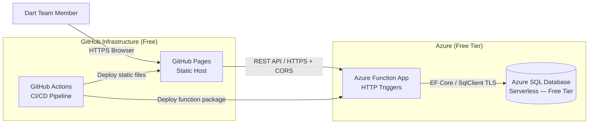
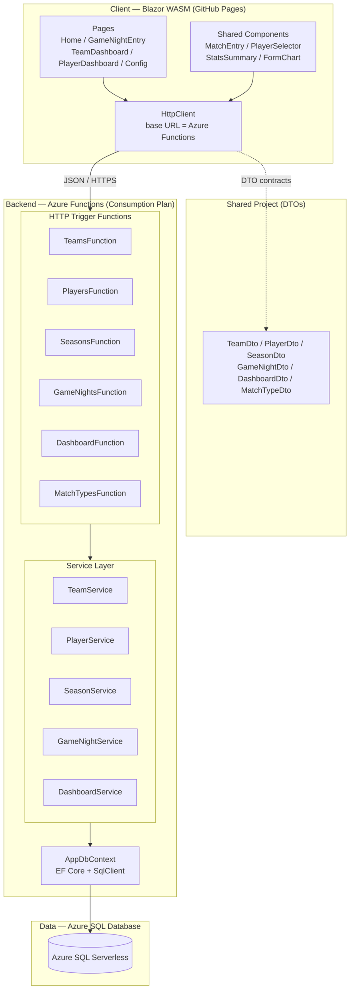
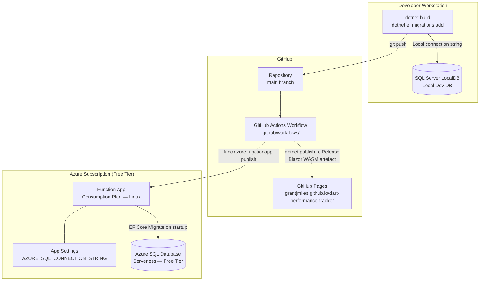
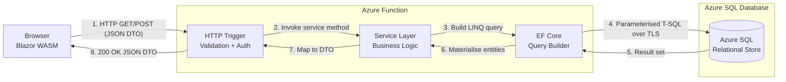
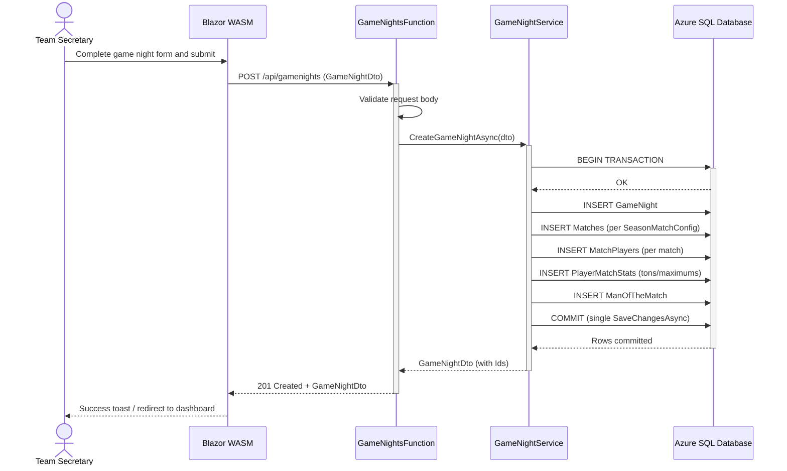
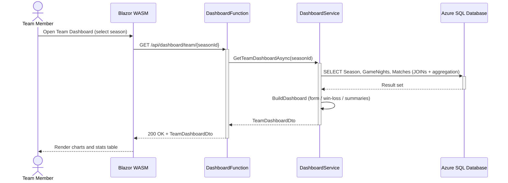
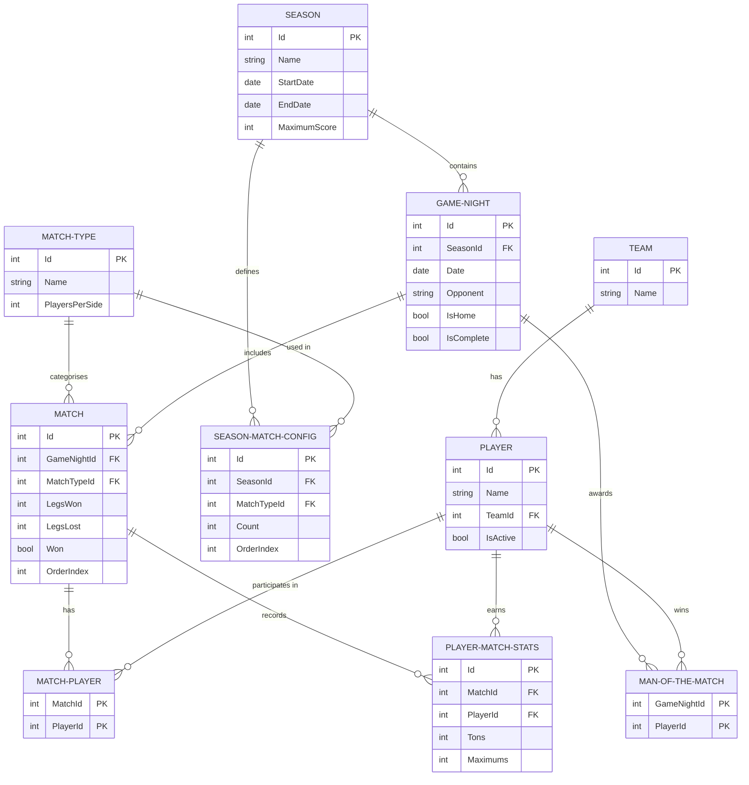

# Dart Performance Tracker — Architecture Plan

## Executive Summary

The current architecture is a **Blazor WebAssembly Hosted** application where the ASP.NET Core server simultaneously hosts the API and serves the WASM client. The database is a file-based SQLite instance that lives on the same machine as the server.

The target architecture eliminates any always-on compute cost by moving to three free-tier services:

| Layer | Current | Target |
|---|---|---|
| Frontend host | ASP.NET Core (same process) | **GitHub Pages** (static CDN) |
| Backend | ASP.NET Core Web API | **Azure Functions** (Consumption plan) |
| Database | SQLite (local file) | **Azure SQL Database** (free serverless tier) |

**Cost at steady state: £0/month** — all three services operate within their permanent free tiers for a low-traffic team statistics app.

---

## Database Choice Rationale

### Why not SQLite in the cloud?
SQLite is a file-based engine — it requires persistent block storage (Azure Files / a VM), which costs money and reintroduces always-on infrastructure.

### Why not Azure Cosmos DB?
Cosmos DB is document-oriented. The Dart Tracker data is **inherently relational**: dashboard statistics require multi-table JOINs, GROUP BY aggregations (sum tons, count man-of-the-match), and complex filters across `GameNight → Match → MatchPlayer → PlayerMatchStats`. Modelling these as nested documents would require redundant denormalisation and make the `DashboardService` queries significantly more complex.

### Why Azure SQL Database (free serverless tier)?
- **Free tier**: 32 GB storage, 100,000 vCore-seconds of serverless compute per month — a low-traffic team app will never leave this allowance
- **Serverless auto-pause**: the database suspends automatically after a configurable idle period (default 1 hour) and resumes on the next connection — zero cost at rest
- **Relational**: full T-SQL, foreign keys, indexes — the existing EF Core schema migrates with a single provider swap (`Microsoft.EntityFrameworkCore.SqlServer`)
- **Co-located with Azure Functions**: both services live in the same Azure region, giving sub-millisecond network latency between the Function App and the database
- **Local development**: SQL Server LocalDB (ships free with Visual Studio) or the `mcr.microsoft.com/mssql/server` Docker image provides an identical engine locally — no external service required
- **Fully managed**: automated backups (7-day point-in-time restore on the free tier), patching, and HA handled by Azure

### Constraint to be aware of
The Azure SQL free offer is limited to **one free database per Azure subscription**. If you already use the free database slot for another project, the next tier (General Purpose serverless, ~$0.50/day minimum) would apply — still inexpensive for a small app.

---

## System Context

The diagram below shows the system boundary and how it fits into the broader ecosystem of free hosting services.



### Key Relationships
- **User → GitHub Pages**: The browser loads the Blazor WASM bundle (HTML/CSS/JS/WASM) as static files. There is no server-side rendering; all UI logic runs in the browser's WebAssembly runtime.
- **GitHub Pages → Azure Functions**: Once loaded, the WASM app makes direct HTTPS calls to the Azure Function App URL. CORS headers on the Function App allow the GitHub Pages origin.
- **Azure Functions → Azure SQL**: The Function App holds the Azure SQL connection string in its Application Settings (encrypted at rest). EF Core opens a connection over TLS using the `Microsoft.Data.SqlClient` driver. Both services are in the same Azure region, so the connection is fast and stays within Azure's private network backbone.
- **GitHub Actions**: A single workflow handles both deployments — the WASM publish artefact goes to the `gh-pages` branch, and the Functions package is published using the Azure Functions CLI.

---

## Component Architecture



### Component Responsibilities

| Component | Responsibility | Changes from current |
|---|---|---|
| **Blazor Pages** | UI logic, form state, navigation | Remove `@inject NavigationManager` server-side helpers; update `HttpClient` base address |
| **Shared Components** | Reusable UI — `MatchEntryComponent`, `PlayerSelectorComponent` etc. | No changes required |
| **HttpClient** | Typed REST calls to the Function App URL | Base address changes from `""` (same-origin) to the Function App URL |
| **Shared DTOs** | Request/response contracts — unchanged DTO types cross the new API boundary exactly as before | No changes |
| **HTTP Trigger Functions** | Replace ASP.NET Controllers — one Function class per domain (Teams, Players, etc.), each with GET/POST/PUT/DELETE methods as separate trigger methods | New — replaces `src/Server/Controllers/` |
| **Service Layer** | Business and persistence logic — **entirely reusable** | Copy from `src/Server/Services/` with no logic changes |
| **AppDbContext** | EF Core context — **entirely reusable** | Only the provider registration changes (`UseSqlite` → `UseSqlServer`) |
| **Azure SQL Database** | Persistent relational data store | New — replaces `dart_tracker.db` file |

### Design Decisions
- **Isolated Process Model**: Azure Functions v4 with the .NET 8/10 **isolated worker process** model is used (not the older in-process model). This gives full control over the dependency injection container, middleware, and is the supported path going forward.
- **Shared project retained**: The `src/Shared` project remains unchanged and is referenced by both the Client WASM project and the new Functions project. DTOs continue to be the only types crossing the API boundary.
- **Service layer reuse**: All five service implementations (`TeamService`, `PlayerService`, etc.) are moved to the Functions project unchanged — the business logic investment is preserved entirely.

---

## Deployment Architecture



### Deployment Strategy

**GitHub Pages**
- The Blazor WASM project is published to `wwwroot` via `dotnet publish`, producing static files only.
- The `<base href="/dart-performance-tracker/" />` tag in `wwwroot/index.html` must match the GitHub Pages subdirectory path.
- A `404.html` file (copy of `index.html`) is required so that GitHub Pages serves the WASM app on deep-link refreshes (GitHub Pages returns 404 for any path it doesn't know about; the WASM router then takes over).
- A `_config.yml` with `include: ['_framework']` must be added — GitHub Pages strips directories starting with `_` by default, but Blazor's output lives in `_framework/`.
- GitHub Actions deploys to the `gh-pages` branch on every push to `main`.

**Azure Function App**
- **Consumption Plan (Linux)**: Zero idle cost. Pay only per execution (1 million free/month) and compute time (400,000 GB-seconds free/month). A team stats app will never leave the free tier.
- **Runtime**: .NET 10 isolated worker.
- The Azure SQL connection string is stored as an **Application Setting** (`AZURE_SQL_CONNECTION_STRING`), never in source control.
- EF Core `Database.Migrate()` runs on Function App startup (cold start). Azure SQL supports EF Core's migration history table and concurrent migration checks safely.

**Azure SQL — Local Development**
- **SQL Server LocalDB** (installed with Visual Studio, zero config) is used for local development. Connection string: `Server=(localdb)\mssqllocaldb;Database=DartTracker;Trusted_Connection=True`.
- Alternatively, the `mcr.microsoft.com/mssql/server:2022-latest` Docker image replicates the production engine exactly.
- The local connection string lives in `local.settings.json` (gitignored). Schema changes follow the existing migration workflow: `dotnet ef migrations add <Name>` targets LocalDB; the migration is committed to source and applied to the production Azure SQL database on the next cold start via `Database.Migrate()`.

### NFR: Deployment
- **Zero-downtime deployments**: Azure Functions Consumption Plan performs slot-swap-free deployments; the Function App restarts with the new package, which takes seconds.
- **Rollback**: Revert the Git commit and re-run the GitHub Actions workflow.

---

## Data Flow



### Data Handling Notes
- **Steps 1–2**: The Function deserialises the request body to a DTO and calls the appropriate service method. Input validation (e.g., required fields, date ranges) happens here.
- **Steps 3–4**: EF Core generates a single, optimised parameterised SQL query. For dashboard endpoints, this includes JOINs across `GameNight`, `Match`, `MatchPlayer`, and `PlayerMatchStats` — exactly as today but now targeting T-SQL / SQL Server syntax.
- **Steps 5–6**: EF Core materialises the result set into domain model objects. The `async/await` chain is maintained throughout — no blocking calls.
- **Steps 7–8**: The service maps domain entities to DTOs (the exact same mapping logic as the current `DashboardService`). The Function returns a typed `OkObjectResult` serialised as JSON.
- **CORS**: The Function App is configured to allow `https://grantjmiles.github.io` as an allowed origin. All responses include `Access-Control-Allow-Origin` headers.

---

## Key Workflows

### Workflow 1: Submit a Game Night



This workflow is the most critical in the application. The atomicity requirement (single `SaveChangesAsync`) is fully preserved — SQL Server transactions behave identically to SQLite transactions from EF Core's perspective.

### Workflow 2: Load Team Dashboard



The `BuildDashboard` logic in `DashboardService` is pure C# computation on in-memory materialised data — it requires no changes whatsoever for the new architecture.

---

## Data Model (Entity Relationship Diagram)

The relational schema is **unchanged**. The ERD below documents the existing model for reference as the migration is planned.



### Why the Schema Needs No Changes
The existing indexes (`Match(GameNightId)`, `MatchPlayer(PlayerId)`, `PlayerMatchStats(PlayerId)`, `GameNight(SeasonId)`) map directly to SQL Server clustered/non-clustered indexes via EF Core. The composite primary keys on `MatchPlayer` and `ManOfTheMatch` are fully supported. No new migrations are required for the schema itself — only the EF Core provider registration changes.

> **Data migration note**: Existing SQLite data can be exported as SQL INSERT statements using `sqlite3 dart_tracker.db .dump`. The INSERT statements require minor adjustments before importing into Azure SQL: `1`/`0` integer literals must replace SQLite's boolean values, and `datetime` literals must use ISO 8601 format (`YYYY-MM-DDTHH:MM:SS`). The SQL Server Management Studio (SSMS) Import Wizard or `sqlcmd` can then load the adjusted file.

---

## Phased Development

### Phase 1: Backend Migration (Azure Functions + Azure SQL)

The highest-risk change is the backend. Phase 1 keeps the Blazor WASM project hosted locally (or temporarily on Azure App Service free tier) while the new Azure Functions backend is built and validated.

**Scope:**
1. Create a new `src/Functions` project targeting .NET 10 isolated worker
2. Install `Microsoft.Azure.Functions.Worker`, `Microsoft.Azure.Functions.Worker.Extensions.Http`, `Microsoft.EntityFrameworkCore.SqlServer`
3. Move `src/Server/Services/` and `src/Server/Data/` into the Functions project unchanged
4. Rewrite `src/Server/Controllers/` as Function classes with HTTP triggers (same routes, same DTOs)
5. Register services in `Program.cs` (Functions host builder)
6. Configure CORS to allow the temporary Client origin
7. Provision the Azure SQL Database free-tier instance (portal: create SQL Database → serverless → free offer); copy the ADO.NET connection string into `local.settings.json` for testing and into the Function App's Application Settings for production
8. Run `dotnet ef migrations add SqlServerInitial` against LocalDB to produce a clean SQL Server-compatible migration
9. Validate all endpoints via Scalar / the existing `.http` test file

**Exit criterion:** All API endpoints return the same responses as the current ASP.NET Core server.

### Phase 2: Frontend Migration (GitHub Pages)

Once the Function App is stable:

1. Remove the `<Hosted>true</Hosted>` flag from the Client `.csproj` (or re-scaffold as standalone WASM)
2. Update `HttpClient` base address in `Program.cs` to the Function App URL
3. Update `<base href>` in `wwwroot/index.html` to `/dart-performance-tracker/`
4. Add `wwwroot/404.html` (copy of `index.html`) for SPA deep-link routing
5. Add `wwwroot/.nojekyll` and `wwwroot/_config.yml` (`include: ['_framework']`)
6. Delete `src/Server` project; update the `.slnx` solution file
7. Add GitHub Actions workflow (`.github/workflows/deploy.yml`) with two jobs: `deploy-wasm` and `deploy-functions`
8. Enable GitHub Pages (Settings → Pages → Source: `gh-pages` branch)

**Exit criterion:** App loads at `https://grantjmiles.github.io/dart-performance-tracker/`, all API calls succeed, and routing works on page refresh.

### Migration Path Summary

```
Week 1: Provision Azure SQL (free tier) → Create Functions project → Migrate services/controllers → Validate locally against LocalDB
Week 2: Deploy Function App to Azure → End-to-end test with production Azure SQL DB
Week 3: Update WASM project → GitHub Pages config → GitHub Actions workflow → Go live
Week 4: Decommission Azure App Service (if any) / remove old Server project
```

---

## Non-Functional Requirements Analysis

### Scalability
- **Azure Functions Consumption Plan** scales out horizontally to handle concurrent requests automatically. Each function instance is stateless, so adding instances is transparent.
- **Azure SQL Database Serverless** scales vCores up automatically under load and auto-pauses when idle. The free tier is single-instance (no read replicas), which is appropriate for a low-traffic team app. If write contention ever becomes an issue, upgrading to a General Purpose tier with read replicas is a straightforward portal change.
- **GitHub Pages** is served from GitHub's global CDN — effectively infinite scale for static assets.

### Performance
- **Cold starts**: Azure Functions on the Consumption plan has a cold start (typically 1–3 seconds for .NET isolated). For a low-traffic team app used intermittently, this is acceptable. Mitigate by keeping the function bundle size small (trim unused assemblies).
- **Dashboard queries**: The existing `DashboardService` LINQ queries are already optimised with relevant indexes. SQL Server's query optimiser produces excellent execution plans for the JOIN-heavy dashboard aggregations and benefits from statistics auto-update. The co-location of the Function App and Azure SQL in the same region removes any cross-region latency.
- **WASM load time**: Blazor WASM has a first-load cost (downloading the .NET runtime). The `_framework` bundle should be compressed (Brotli/gzip) — GitHub Pages serves files as-is, so pre-compressed `.br` files published by `dotnet publish` will be served automatically by browsers that support them.

### Security
- **Secrets**: The Azure SQL connection string is stored exclusively in Azure Function App Settings (encrypted at rest). It is never committed to the repository. For additional security, consider using a **Managed Identity** connection (no password in the connection string at all) — the Function App's system-assigned identity can be granted `db_datareader`/`db_datawriter` roles directly in Azure SQL.
- **CORS**: The Function App's allowed origins whitelist is restricted to `https://grantjmiles.github.io`. Wildcard origins (`*`) must not be used.
- **HTTPS**: GitHub Pages enforces HTTPS. Azure Functions is HTTPS-only on the Consumption plan. Azure SQL requires TLS 1.2 for all connections by default.
- **No authentication (current state)**: The app currently has no authentication. This is a known gap — anyone who discovers the Function App URL can call the API directly. For a private team app, adding Azure Functions key-based authentication (`?code=...`) or Azure Static Web Apps authentication (free tier) would be a low-effort improvement.
- **Input validation**: The existing service layer already validates DTOs. No regression expected.

### Reliability
- **Azure Functions Consumption Plan SLA**: 99.95% monthly uptime SLA.
- **Azure SQL free tier**: No formal SLA on the free database tier, but the underlying infrastructure uses the same highly available storage (locally redundant by default) as paid tiers, with automatic backups and 7-day point-in-time restore. For a team statistics app (non-critical workload), this is more than sufficient.
- **GitHub Pages**: 99.9%+ availability backed by GitHub's CDN.
- **Fault isolation**: An Azure SQL or Function App outage affects the API only; the WASM app shell continues to load from GitHub Pages. Users see a friendly API error rather than a blank page.

### Maintainability
- **Service layer unchanged**: All business logic in `DashboardService`, `GameNightService` etc. is preserved verbatim. Developers familiar with the codebase will not face a learning curve.
- **EF Core migrations**: The existing migration workflow (`dotnet ef migrations add`) continues to work. The only difference is the provider package and connection string.
- **Local development**: Developers run the Functions host locally (`func start`) against SQL Server LocalDB. The experience is identical to running `dotnet run` against the local SQLite file, and LocalDB requires no installation beyond Visual Studio.
- **Shared project**: The `src/Shared` project remains the single source of truth for DTOs, ensuring Client and Functions stay in sync.

---

## Risks and Mitigations

| Risk | Likelihood | Impact | Mitigation |
|---|---|---|---|
| Azure SQL free database slot already consumed by another project | Low | Medium | Confirm the subscription has no existing free-tier Azure SQL database before provisioning. If the slot is taken, the General Purpose serverless tier at ~$0.50/day minimum is the next option — still cheap for a small app. |
| Azure Functions cold start perceived as slow | Medium | Low | Pre-warm with a lightweight `GET /api/health` ping from the WASM app on load; alternatively enable Always Ready (1 instance) at ~$3/month if latency is unacceptable. |
| GitHub Pages `_framework` assets blocked by Jekyll | Medium | High | Add `wwwroot/.nojekyll` file to the published output — this tells GitHub Pages to skip Jekyll processing entirely. |
| SPA routing breaks on deep-link refresh | High | Medium | The `404.html` redirect trick is well-established for GitHub Pages SPAs. Must be implemented in Phase 2. |
| SQLite data loss during migration | Low | High | Export SQLite data to SQL before any schema changes. Keep the original `dart_tracker.db` as backup until Phase 2 is confirmed stable. |
| CORS misconfiguration blocks API calls | Medium | High | Test CORS from the exact GitHub Pages origin before Phase 2 go-live. Use browser DevTools Network tab to inspect preflight responses. |
| Azure subscription free tier exhausted | Low | Low | The Consumption plan free grant (1M executions, 400K GB-s) far exceeds the usage of a team stats app. Monitor in Azure Cost Management. |

---

## Technology Stack — Target

| Layer | Technology | Version | Notes |
|---|---|---|---|
| Frontend runtime | Blazor WebAssembly | .NET 10 | Unchanged |
| Frontend host | GitHub Pages | — | Free, CDN-backed |
| Backend runtime | Azure Functions | v4, .NET 10 isolated | Replaces ASP.NET Core |
| ORM | EF Core | 10.x | Provider swap only |
| DB driver | Microsoft.EntityFrameworkCore.SqlServer | 10.x | Replaces `Microsoft.EntityFrameworkCore.Sqlite` |
| Database | Azure SQL Database (Serverless) | SQL Server 2022 compat. | Replaces SQLite file; free tier (32 GB, 100k vCore-s/mo) |
| CI/CD | GitHub Actions | — | Free for public repos |
| API docs (dev) | Scalar / OpenAPI | — | Re-enabled on local Functions host |

---

## Next Steps

1. **Provision Azure SQL Database**: In the Azure portal, create a new SQL Database → select **Serverless** compute tier → enable the **Free offer**. Copy the ADO.NET connection string. Confirm the subscription doesn't already use its free database slot.
2. **Create `src/Functions` project**: `dotnet new func --worker-runtime dotnet-isolated --target-framework net10.0 -o src/Functions`
3. **Swap EF Core provider**: Replace `Microsoft.EntityFrameworkCore.Sqlite` with `Microsoft.EntityFrameworkCore.SqlServer` in the Functions project; update `UseSqlServer(...)` in the DI registration.
4. **Migrate schema**: Run `dotnet ef migrations add SqlServerInitial --project src/Functions` against LocalDB to generate the initial SQL Server-compatible migration, then apply to Azure SQL via `Database.Migrate()` on first cold start.
5. **Port controllers to functions**: Each `XController.cs` becomes a `XFunction.cs` class with `[Function("...")]` attributes; inject the same `IXService` interface.
6. **Configure CORS**: In the Functions host builder, add `AllowedOrigins: ["https://grantjmiles.github.io"]` in `host.json` or via middleware.
7. **Update WASM `Program.cs`**: Change the `HttpClient` `BaseAddress` to the deployed Function App URL.
8. **GitHub Pages config**: Add `.nojekyll`, `404.html`, and update `<base href>`.
9. **GitHub Actions workflow**: Two jobs — `build-and-deploy-wasm` and `deploy-functions`.
10. **Delete `src/Server`**: Once Phase 2 is validated end-to-end, remove the ASP.NET Core server project from the solution.
